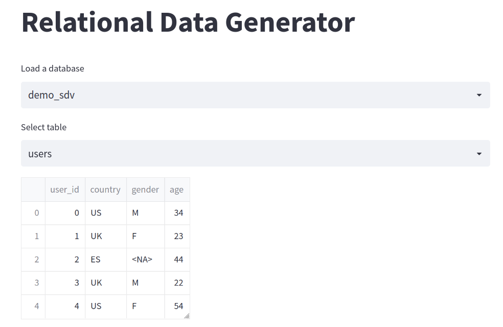
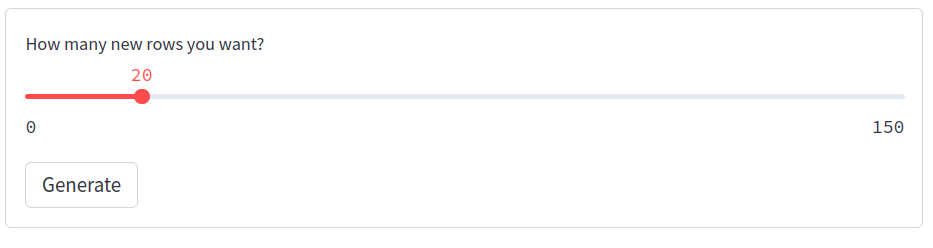
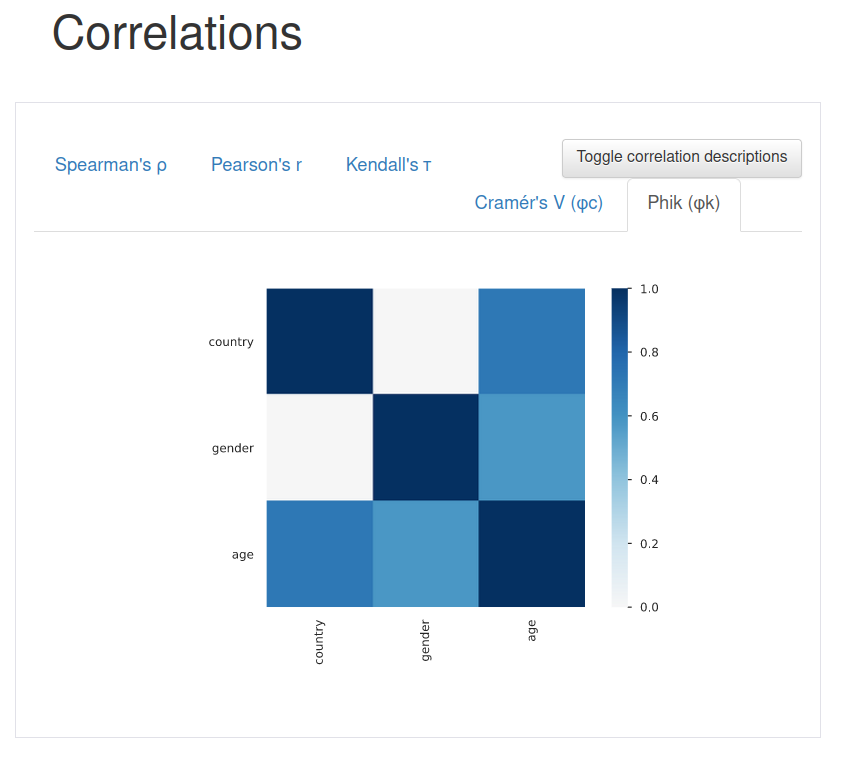

# Relational-Data-Generetor
This is a PoC using SDV library to generate fresh new relational data keeping their metadata schema! Finally, profiling them to have some statistics.

Using HMA1 algorithm, provided by SDV library, generating, consistent relational data, is possible in few steps. 

```bash
streamlit run streamlit.py
```
or

[Streamlit Cloud](https://mfranzon-relational-data-generetor-streamlit-q0qinz.streamlitapp.com/)

You will see a simple demo app in which:
- you can select a simple database, made of 3 tables with few relationships

- generate a certain amount of new relational data

- obtain a report made with pandas-profiling with some useful statistic about the new data. 

1. Select dataframe



2. Generate



3. Profiling

